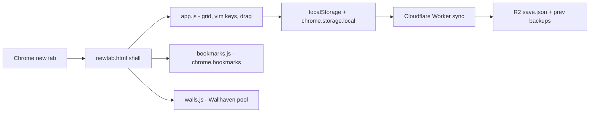

# Glisters — New Tab

> Minimal keyboard-first new tab — vim shortcut grid, live Chrome bookmarks, Wallhaven wallpapers, Cloudflare sync.


---


<br><br>


## Why This Project Exists

A new-tab page is dead time and a sync layer is usually a silent data-loss trap. Glisters makes the page fully keyboard-driven and treats the cloud as a hostile boundary where a fresh install must never clobber real data.

## What It Does

- **Vim shortcut grid** — navigate, open, add, edit, delete every tile with keys only (`h j k l`, `enter`, `a`, `e`, `d`); the mouse stays optional and never steals the address bar (`js/app.js:902`).
- **Butter-smooth drag-reorder** — drag a tile and the others FLIP out of the way live, with edge auto-flip across pages; dropping lands the tile exactly where you left it (`js/app.js:1133`).
- **Live bookmarks sidebar** — a direct editor for Chrome's real bookmarks, written straight through `chrome.bookmarks`; changes from any device appear instantly (`js/bookmarks.js:669`).
- **Daily wallpaper pool** — 10 wide Wallhaven toplist shots (≥1.5:1) cycled with `w`, favourites capped at 60, and a safe default that survives pool swaps (`js/walls.js:43`).
- **Cloud sync with a parachute** — the whole save mirrors to R2 **per user**
  (Clerk sign-in; every device signed in as you syncs the same save). Every
  accepted write keeps the previous two saves recoverable via `/backup`
  (`worker/src/index.js:208`).
- **Auto-detected metadata** — add a URL and the name plus icon picker fill themselves, fetched direct or via the worker's `/meta`, capped at 4 MB and an 8 s abort (`js/app.js:1506`).
- **Command bar** — `/` or `:` matches by name, then URL, then Google; pasting an image reverse-searches it (`js/app.js:1605`).

Real bounds enforced in code: site names clamped to 300 chars, URLs to 4096, icons `https://` only (`js/app.js:226`); delete requires a 2.5 s arm-and-confirm (`js/app.js:988`).

## Architecture



Changing a setting stamps `updatedAt` and `persistLocal()` dual-writes, then `scheduleCloud()` PUTs the whole doc to the worker within 1.3 s (`js/app.js:1935`), which rotates the old save to `save.prev1.json` before accepting the write (`worker/src/index.js:218`).

## Key Technical Decisions

### 1. Two-Tier State (storage hierarchy)

**Problem:** A new-tab page reloads constantly and localStorage can be evicted, so a single store loses the save.

**Solution:** Every commit writes both localStorage (fast boot read) and `chrome.storage.local` (durable mirror); the cloud is a newer-wins third copy.

**Outcome:** Boot reads the fast copy first, reconciles the durable one, and never lets a fresh seed overwrite a real save. `js/app.js:257`

### 2. A Sync Protocol That Never Loses a Save (correctness)

**Problem:** Last-write-wins silently discards data, and a wiped local store seeding over the cloud is the worst clobber.

**Solution:** The worker rejects PUTs with an older `updatedAt` (409) and rejects seed-flagged pushes over an existing save; before every accepted write it rotates the old doc to `save.prev1`/`save.prev2`.

**Outcome:** Any clobber — bug, stale client, malicious PUT — is one `GET /backup` away from being undone. `worker/src/index.js:197`

### 3. The Cloud Boundary Is Hostile (security)

**Problem:** A hostile/buggy client must never clobber the save, execute code
in the extension, or read another user's data.

**Solution:** Every `/save` and `/backup` request carries a Clerk-session JWT
verified by the worker (`@clerk/backend`, `CLERK_SECRET_KEY` as a wrangler
secret) — missing/forged/expired tokens get 401, and each user's save lives at
its own R2 key. `normalize()` clamps name ≤300 and url ≤4096, accepts only
http(s) icons, and `normUrl()` refuses to navigate
`javascript:`/`data:`/`file:` schemes.

**Outcome:** A tampered save cannot execute code in the extension or inject
styles; unauthenticated requests cannot read or write anything.
`js/app.js:226`

### 4. SSRF-Proof Metadata Proxy (security)

**Problem:** `/meta` fetches an arbitrary URL server-side — a classic SSRF surface.

**Solution:** `isPrivateHost()` rejects private, loopback, link-local and metadata ranges plus non-80/443 ports; redirects are followed manually (≤3 hops) with the guard re-run per hop and a 4 MB body cap.

**Outcome:** A hostile page cannot bounce the fetch to an internal address; failures return empty metadata, not errors. `worker/src/index.js:42`

### 5. Three-Layer Favicon Cache (performance)

**Problem:** Resolving 4–6 favicon candidates per tile on every boot is the biggest repeated cost of a page opened constantly.

**Solution:** A persisted winner is tried first (one usually cache-hit request), decoded elements are reused across page flips in memory, and failures retry with 5 s backoff.

**Outcome:** Repeat boots resolve each tile with roughly one request instead of a candidate blast. `js/app.js:443`

## Run Locally

Node ≥18 is required for the scripts and the worker; the extension itself is plain script tags with **zero npm dependencies** — sign-in reads the Clerk `__session` cookie via `chrome.cookies` (no ClerkJS bundle, no remote code ever runs).

```bash
# extension — zero-config: loads with no .env; sync just reports "cloud off"
chrome://extensions → Developer mode → Load unpacked → this folder

# optional build helpers
node scripts/gen-icons.mjs    # regenerate icons/ PNGs (zero deps)
node scripts/gen-config.mjs   # regenerate js/config.js from .env
node scripts/gen-auth.mjs     # copy js-src/auth.js → js/auth.js (no bundling)

# cloud worker — production deploy (binding: R2 bucket "jigar")
cd worker
wrangler secret put CLERK_SECRET_KEY   # Clerk secret key — never in .env
wrangler deploy
```

Zero-config: yes. Without `.env`, the grid still renders from baked defaults plus `links.txt`; cloud sync (sign-in gated) and the NSFW wallpaper option simply stay off.

## Configuration

| Env var | Required | Effects when set |
|---|---|---|
| `R2_WORKER_URL` | ✅ | Enables cloud sync and the `/meta` fallback; unset → sync pill reads "cloud off", grid works locally |
| `CLERK_PUBLISHABLE_KEY` | — | Enables the account row and sign-in; unset → sync reads "not configured", grid works locally |
| `WALLHAVEN_API_KEY` | — | Seeds the drawer key field and unlocks the NSFW purity option; unset → NSFW button disabled (`js/walls.js:948`) |

## Project Structure

```
manifest.json             MV3 manifest; new-tab override, pinned key, CSP
newtab.html               Static shell; loads the six JS modules in order
js-src/auth.js            Cookie-based auth source (copied → js/auth.js, gitignored)
js/app.js                 Core: grid, vim keys, drag-reorder, modal, sync orchestration
js/bookmarks.js           Bookmarks sidebar — direct chrome.bookmarks editor
js/walls.js               Wallhaven pool, favourites, safe wallpaper, blob cache
js/sync.js                Thin worker client (GET/PUT /save, Bearer JWT)
js/config.js              Generated runtime config (worker URL, wallhaven key, publishable key)
worker/src/index.js       Worker: JWT auth, per-user LWW + seed guard, prev rotation, /backup, /meta
scripts/gen-config.mjs    Regenerates js/config.js from .env
scripts/gen-auth.mjs      Copies js-src/auth.js → js/auth.js (no esbuild)
links.txt                 Optional first-run seed, one URL per line
```

---

Never lose a save, never lose a favourite, and every tile answers to the keyboard.

---

<div align="left">
  <font face="Aref Ruqaa" size="5">فیروز خان چوہان</font>
</div>
