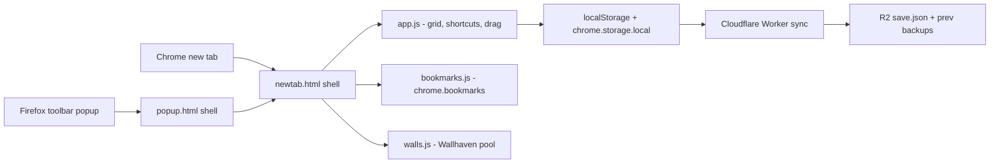

# Glisters — New Tab

> Minimal new tab — shortcut grid, live Chrome bookmarks, Wallhaven wallpapers, Cloudflare sync.


---


<br><br>

<br><br>


## Features

- **Shortcut grid** — vim-style keys (`h j k l`, `enter`, `a`, `e`, `d`) plus mouse drag-reorder with live flip animations and edge auto-flip across pages.
- **Live bookmarks sidebar** — a direct editor for Chrome's real bookmarks; changes from any device appear instantly.
- **Daily wallpaper pool** — 10 wide Wallhaven toplist shots cycled with `w`, favourites, a safe default, and optional NSFW (bring your own Wallhaven API key).
- **Cloud sync with a parachute** — per-user R2 mirror (Clerk sign-in); every write keeps the previous two saves recoverable via `/backup`, and a fresh install can never clobber real data.
- **Zero-config clone** — `js/config.js` + `js/auth.js` ship committed, so sync and sign-in work out of the box.
- **No bundler, no framework, no runtime deps** — plain ES5 script tags.

## Architecture



**Chrome** uses `chrome_url_overrides.newtab`; **Firefox** has no newtab override, so the Firefox build mounts the same `newtab.html` inside a toolbar popup (`popup.html`, an extension-page iframe) with an "open in tab" affordance. All runtime code is shared — the only Firefox-specific files are the manifest, the popup shell, and `scripts/build-firefox.mjs`.

Safety rails: every `/save` request carries a Clerk JWT verified by the worker; saves are last-write-wins with seed-guard and automatic previous-save rotation; the SSRF-proofed `/meta` proxy and client-side `normalize()` sanitize everything crossing the cloud boundary.

## Run Locally

Node ≥18 for the scripts/worker; the extension itself is zero npm dependencies.

```bash
# chrome — load unpacked from chrome://extensions
chrome://extensions → Developer mode → Load unpacked → this folder

# firefox — temporary add-on from about:debugging
#   (or the proper way: npm run build:firefox, then upload the zip to AMO)
about:debugging#/runtime/this-firefox → Load Temporary Add-on → dist/firefox/manifest.json

# cloud worker
cd worker
wrangler secret put CLERK_SECRET_KEY   # Clerk secret key — never in .env
wrangler deploy
```

## Publish to Firefox (AMO)

Firefox has no `chrome_url_overrides`, so the Firefox build is a toolbar popup
that opens the grid (Ctrl+Shift+Space, user-assignable) with an "open in tab"
button for the full page. The extension itself is unchanged — same grid,
bookmarks, wallpapers, and Clerk sync.

```bash
npm run build:firefox      # → dist/glisters-firefox-<version>.zip (AMO-ready)
npm run lint:firefox       # web-ext lint — 0 errors, no secrets in the zip
```

The zip is signed by AMO on submission — there is no sideloading in release
Firefox. See the manifest notes below before your first upload.

### Firefox manifest notes (`manifest.firefox.json`)

- **`browser_specific_settings.gecko.id`** — `glisters@firozchauhan.dev`; AMO
  requires an explicit id, and it defines the extension's Clerk allowed origin
  (`moz-extension://…`). Add that origin in the Clerk dashboard.
- **`data_collection_permissions`** — required for new AMO submissions: the
  extension transmits authentication data, the saved shortcut list, and your
  email to Clerk / the worker for sync.
- **`strict_min_version: 140`** — the version that supports the consent data
  (`gecko_android` is 142, where Android added it).
- **No `chrome_url_overrides`, no `key`, no `sandbox`** — all Chrome-only;
  `captcha.html` (Turnstile) is deliberately excluded from the Firefox package
  (Firefox has no sandbox pages), and `auth.js` auto-detects the missing page
  and skips the widget (Clerk bot protection is off anyway).
- **3 lint warnings** are the pre-existing static-SVG `innerHTML` assignments
  in `bookmarks.js` (sanctioned pattern — dynamic strings always use
  `textContent`); they do not block submission.

## Configuration

| Env var | Required | Effect |
|---|---|---|
| `R2_WORKER_URL` | ✅ | Enables cloud sync |
| `CLERK_PUBLISHABLE_KEY` | — | Enables sign-in |
| `WALLHAVEN_API_KEY` | — | Unlocks NSFW (never shipped — users add their own) |

## Project Structure

```
js/app.js                 Grid, shortcuts, drag-reorder, sync orchestration
js/bookmarks.js           Bookmarks sidebar — direct chrome.bookmarks editor
js/walls.js               Wallhaven pool, favourites, safe wallpaper, blob cache
js/sync.js                Thin worker client (GET/PUT /save, Bearer JWT)
js/config.js              Generated runtime config (worker URL, publishable key)
worker/src/index.js       JWT auth, per-user LWW + seed guard, prev rotation, /backup, /meta
scripts/                  Build helpers (gen-config, gen-auth, gen-icons, build-firefox)
manifest.firefox.json     Firefox manifest (toolbar popup entry, gecko id)
popup.html / popup.js     Firefox popup shell — iframes newtab.html
css/popup.css             Popup shell sizing/styling
links.txt                 Optional first-run seed, one URL per line
```

---

Never lose a save, never lose a favourite.

---

<div align="left">
  <font face="Aref Ruqaa" size="5">فیروز خان چوہان</font>
</div>
